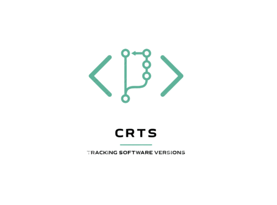

# Change Request Tracking System (CRTS)
<p align="center">
  
</p>

<p align="center">
  <a href="#"></a>
  <a href="#"></a>
  <a href="#"></a>
</p>

<p align="center">
  A comprehensive full-stack web application for managing software change requests across development projects. Built with modern technologies and featuring role-based access control for efficient project management.
</p>

## Overview
Like any software team, we’ve all felt the frustration of chasing down change requests, lost email threads, and unclear deployment histories. I experienced it firsthand while working on various projects, where keeping track of who requested what, when it was deployed, and what issues followed could become chaotic quickly. That challenge led me to build the **Change Request Tracking System (CRTS)**, a comprehensive, full-stack web application designed to centralize and streamline the management of software change requests across development projects. In environments where accountability and traceability are crucial for quality delivery, CRTS has your back. It keeps projects organized, teams informed, and change management transparent, because when systems work smoothly, so do people.

> **Note**: This project consists of two separate repositories:
> - **Frontend**: [ChangeRequest_TrackingSystem](https://github.com/N-benitha/ChangeRequest_TrackingSystem.git)
> - **Backend**: [backend](https://github.com/N-benitha/backend.git)

Demo is Live [here](https://youtu.be/dvN3Xt_-GRU)🔥.Feel free to check it for better understanding.

## 🚀 Features

### Core Functionality
- **Project Management** - Create, update, and manage software projects
- **Change Request Tracking** - Submit, review, and track change requests with status updates
- **User Management** - Admin controls for user creation and role assignment
- **Role-Based Access Control** - Three distinct user roles with specific permissions
- **Real-time Reports** - Analytics and reporting dashboard with filtering options
- **Project Assignment** - Assign users to specific projects with proper authorization

### User Roles & Permissions

| Role | Permissions |
|------|-------------|
| **Admin** | Full system access, user management, project management, reports |
| **Approver** | Review and approve/reject change requests, view reports |
| **Developer** | Create change requests, view assigned projects, track request history |

## 🛠️ Tech Stack

### Frontend Repository: [ChangeRequest_TrackingSystem](https://github.com/N-benitha/ChangeRequest_TrackingSystem.git)
- **React.js** with TypeScript
- **React Router** for navigation
- **Axios** for API communication
- **FontAwesome** icons
- **Modern CSS** with responsive design
- **Vite** for development and building

### Backend Repository: [backend](https://github.com/N-benitha/backend.git)
- **NestJS** with TypeScript
- **PostgreSQL** database
- **TypeORM** for database operations
- **JWT Authentication** with HTTP-only cookies
- **bcrypt** for password hashing
- **Role-based guards** for authorization

## 📋 Prerequisites

Before running this project, make sure you have:

- **Node.js** (v16 or higher)
- **npm** or **yarn**
- **PostgreSQL** (v12 or higher)
- **Git**

## 🚀 Installation & Setup

### 1. Clone Both Repositories

```bash
# Clone the frontend repository
git clone https://github.com/yourusername/ChangeRequest_TrackingSystem.git

# Clone the backend repository
git clone https://github.com/yourusername/backend.git
```
### 2. PostgreSQL Database Setup

```bash
# Start PostgreSQL service
sudo service postgresql start

# Login to PostgreSQL
sudo -u postgres psql

# Create database
CREATE DATABASE crts IF NOT EXISTS;

# Create user (optional, or use existing postgres user)
CREATE USER crts_user IF NOT EXISTS WITH PASSWORD 'your_password';
GRANT ALL PRIVILEGES ON DATABASE crts TO crts_user;

# Exit PostgreSQL
\q
```

### 3. Backend Setup

```bash
# Navigate to backend repository
cd backend

# Install dependencies
npm install

# Database configuration is already set in typeorm.config.ts
# Make sure your PostgreSQL credentials match:
# - host: localhost
# - port: 5432
# - username: postgres
# - password: admin
# - database: crts

# Start the backend server (TypeORM will create tables automatically)
npm run start:dev
```

### 4. Frontend Setup
```bash
# Navigate to frontend repository (in a new terminal)
cd ChangeRequest_TrackingSystem

# Install dependencies
npm install

# Create environment file (if needed)
echo "VITE_API_URL=http://localhost:3000" > .env

# Start the development server
npm run dev
```

### 4. Verify Setup

- Frontend: <u>http://localhost:5173</u>
- Backend API: <u>http://localhost:3000</u>
- API Health Check: <u>http://localhost:3000/auth/me</u>

🎯 Usage
Getting Started

### 1. Start Both Servers
```bash
# Terminal 1 - Backend
cd backend && npm run start:dev

# Terminal 2 - Frontend
cd ChangeRequest_TrackingSystem && npm run dev
```

### 2. Initialize Database with Default Users
Since the database starts empty, you'll need to create users through the signup endpoint or manually insert them. Here are sample users you can create for testing:
**Admin User:**
```
Username: admin
Email: admin@crts.com
Password: admin123
User Type: ADMIN
```

**Approver User:**
```
Username: approver
Email: approver@crts.com
Password: approver123
User Type: APPROVER
```

**Developer User:**
```
Username: developer
Email: developer@crts.com
Password: developer123
User Type: DEVELOPER
```

#### Option 1: Create via Signup Page

1. Go to <u>http://localhost:5173/signup</u>
2. Register the admin user first
3. Login as admin and create other users through the admin panel

#### Option 2: Create via API (using curl or Postman)
```bash
# Create Admin user
curl -X POST http://localhost:3000/auth/signup \
  -H "Content-Type: application/json" \
  -d '{
    "username": "admin",
    "email": "admin@crts.com",
    "password": "admin123"
  }'

# Create Approver user
curl -X POST http://localhost:3000/auth/signup \
  -H "Content-Type: application/json" \
  -d '{
    "username": "approver",
    "email": "approver@crts.com",
    "password": "approver123"
  }'

# Create Developer user
curl -X POST http://localhost:3000/auth/signup \
  -H "Content-Type: application/json" \
  -d '{
    "username": "developer",
    "email": "developer@crts.com",
    "password": "developer123"
  }'
```
> **Note**: You may need to update user types in the database manually because signup doesn't allow role selection, or modify the signup endpoint to accept user_type during registration.

### 3. Create Your First Project

- Log in as admin
- Navigate to Projects → Add Project
- Fill in project details

### 4. Add Team Members

- Go to Users → Add User
- Assign appropriate roles
- Assign users to projects

### Workflow Example

1. Admin creates projects and assigns developers
2. Developer submits change requests for assigned projects
3. Approver reviews and approves/rejects requests
4. All users can view reports and track progress

## 🔒 Authentication & Security

- JWT Tokens stored in HTTP-only cookies
- Password Hashing using bcrypt with salt rounds
- Role-Based Authorization with custom NestJS guards
- Input Validation on all endpoints using DTOs
- CORS Protection configured for frontend domain
- TypeORM with automatic schema synchronization (development only)

## 📊 API Endpoints
### Authentication
```
POST /auth/login          # User login
POST /auth/logout         # User logout
POST /auth/signup         # User registration
GET  /auth/me             # Get current user
POST /auth/refresh        # Refresh JWT token
```
### Users (Admin only)
```
GET    /users            # Get all users
POST   /users/create     # Create new user
GET    /users/:id        # Get user by ID
PATCH  /users/:id        # Update user
DELETE /users/:id        # Delete user
```
### Projects
```
GET    /project/all-projects     # Get all projects
POST   /project/create           # Create project
GET    /project/:id              # Get project by ID
PATCH  /project/:id              # Update project
DELETE /project/:id              # Delete project
```
### Change Requests
```
GET    /change-request/all-users         # Get all change requests
POST   /change-request/create            # Create change request
GET    /change-request/query             # Query change requests with filters
PATCH  /change-request/:id               # Update change request status
DELETE /change-request/:id               # Delete change request
```
### User-Project Assignment
```
GET    /user-project/all                 # Get all projects assigned to all users
POST   /user-project                     # Assign user to project
GET    /user-project/:id                 # Get projects assigned to a user
PATCH  /user-project/:id                 # Update user-projects
DELETE /user-project/:id                 # Remove user-project
```

## 🚀 Deployment
### Production Build
#### Frontend (ChangeRequest_TrackingSystem):
```bash
cd ChangeRequest_TrackingSystem
npm run build
# Deploy dist/ folder to your hosting service
```
#### Backend:
```bash
cd backend
npm run build
npm run start:prod
```
### Environment Setup for Production
**Important:** For production, you should:
1. Create a proper `.env` file in the backend:
```.env
# Database
DB_HOST=your_production_host
DB_PORT=5432
DB_USERNAME=your_production_user
DB_PASSWORD=your_production_password
DB_DATABASE=crts

# JWT
JWT_SECRET=your_super_secret_jwt_key_minimum_32_characters
JWT_EXPIRES_IN=24h

# Application
PORT=3000
NODE_ENV=production

# CORS (for frontend)
FRONTEND_URL=https://your-frontend-domain.com
```
2. Update `typeorm.config.ts` to use environment variables:
```typescript
export const typeOrmConfig: TypeOrmModuleOptions = {
  type: 'postgres',
  host: process.env.DB_HOST || 'localhost',
  port: parseInt(process.env.DB_PORT) || 5432,
  username: process.env.DB_USERNAME || 'postgres',
  password: process.env.DB_PASSWORD || 'admin',
  database: process.env.DB_DATABASE || 'crts',
  entities: [User, Project, ChangeRequest, UserProject],
  synchronize: process.env.NODE_ENV !== 'production', // NEVER use in production
  logging: process.env.NODE_ENV === 'development',
}
```
3. Set `synchronize: false` in production and use migrations instead

### Deployment Options

- Frontend: Vercel, Netlify, GitHub Pages
- Backend: Heroku, DigitalOcean, AWS, Railway
- Database: PostgreSQL on cloud providers

## 🤝 Contributing
### For Frontend Repository (ChangeRequest_TrackingSystem)

1. Fork the [ChangeRequest_TrackingSystem](https://github.com/N-benitha/ChangeRequest_TrackingSystem.git) repository
2. Create a feature branch: git checkout -b feature/frontend-feature
3. Make your changes and commit: git commit -m 'Add frontend feature'
4. Push to branch: git push origin feature/frontend-feature
5. Open a Pull Request

### For Backend Repository

1. Fork the [backend](https://github.com/N-benitha/backend.git) repository
2. Create a feature branch: git checkout -b feature/backend-feature
3. Make your changes and commit: git commit -m 'Add backend feature'
4. Push to branch: git push origin feature/backend-feature
5. Open a Pull Request

### Development Guidelines

- Follow TypeScript best practices in both repositories
- Maintain consistent code formatting (Prettier/ESLint)
- Write meaningful commit messages
- Test your changes locally with both the frontend and backend running
- Update documentation as needed

## 🐛 Common Issues & Solutions
### CORS Issues
**Problem:** Frontend can't connect to backend
**Solution:**
```typescript
// In backend main.ts
app.enableCors({
  origin: 'http://localhost:5173', // or your frontend URL
  credentials: true
});
```
### Database Connection Issues
```bash
# Check PostgreSQL service
sudo service postgresql status

# Verify database exists
sudo -u postgres psql -c "\l" | grep crts

# Check if tables are created
sudo -u postgres psql -d crts -c "\dt"
```
### TypeORM Synchronization Issues
```bash
# If tables aren't created automatically, restart the backend
npm run start:dev

# Check the console for TypeORM logs showing table creation
```

### Port Already in Use
```bash
# Kill process on port 3000 (backend)
lsof -ti:3000 | xargs kill -9

# Kill process on port 5173 (frontend)
lsof -ti:5173 | xargs kill -9
```
### Authentication Issues

- Clear browser cookies and localStorage
- Check database for user records
- Verify API_URL in frontend environment

### Module Not Found Errors
```bash
# Clear node_modules and reinstall
rm -rf node_modules package-lock.json
npm install
```
## 📝 API Configuration
### Frontend API Setup
The frontend uses Axios with base configuration:
```typescript
// src/api/axios.ts
import axios from 'axios';

const api = axios.create({
  baseURL: import.meta.env.VITE_API_URL || 'http://localhost:3000',
  withCredentials: true,
});

export default api;
```
## 🔗 Repository Links

Frontend: [ChangeRequest_TrackingSystem](https://github.com/N-benitha/ChangeRequest_TrackingSystem.git)
Backend: [backend](https://github.com/N-benitha/backend.git)

## 🙏 Acknowledgments

- **ALX Africa** - This project was developed as part of the ALX Software Engineering Program. Special thanks to ALX for providing world-class software engineering education and the opportunity to build real-world applications that solve practical problems.
- **ALX Technical Mentors** - For guidance on best practices, code architecture, and professional development standards

## 👨‍💻 Author
**Benitha Ngunga** - ngungabn03@gmail.com

## 📝 License
This project is licensed under the [MIT License](LICENSE).

## Contact
For support or inquiries, do not hesitate to contact me [here](https://www.linkedin.com/in/ngunga-benitha-26b43921b?utm_source=share&utm_campaign=share_via&utm_content=profile&utm_medium=android_app).

⭐ If you found this project helpful, please give both repositories a star!

*This project represents the culmination of skills learned through the ALX Software Engineering Program, demonstrating proficiency in full-stack development, database design, authentication systems, and modern web technologies.*
